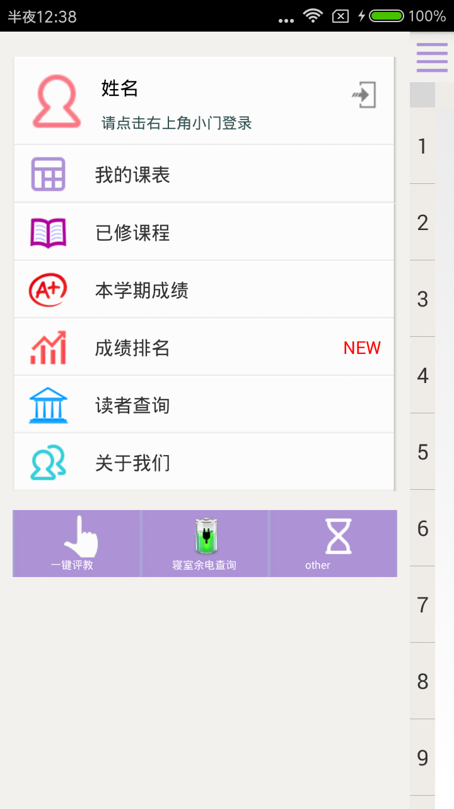

CourseAssistant
===============
   This project why reduce ?
   It's one year ago(2013/10/01), I wan't a Convenient tool can get my borrow book record at any time.
   And now,I exactly learned some knowledge about  Android. So I start this project by while learn and search.

## 主要实现思路：
  HTTP 模拟登陆校园网，分析提取网页数据.
## 作者(Author):
   Quan Sun , Qidong Tan 
## 版本更新(Version Update):
   
### version 2.1.1  2014/12/13 17:02
   实现了一建评教,优化界面UI.
   some problem:
      解析课程 和 图书的代码有待优化.....
   
### version 2.1.0 
  
  做了界面优化，全部采用Fragment滑动页面。
  新增了 课程的增加，修改，更新
  new function in the next version:
  一键评教 功能正在添加...
  
### version 1.0
  I use HttpURLConnection simulation login web page that is  our school(Hunan Agriculture University) Manager System. We through special lable to extract the data we need.  
  Main  function: 简单实现了一键获取课表，查阅借阅的书籍，以及一键续借等功能。
